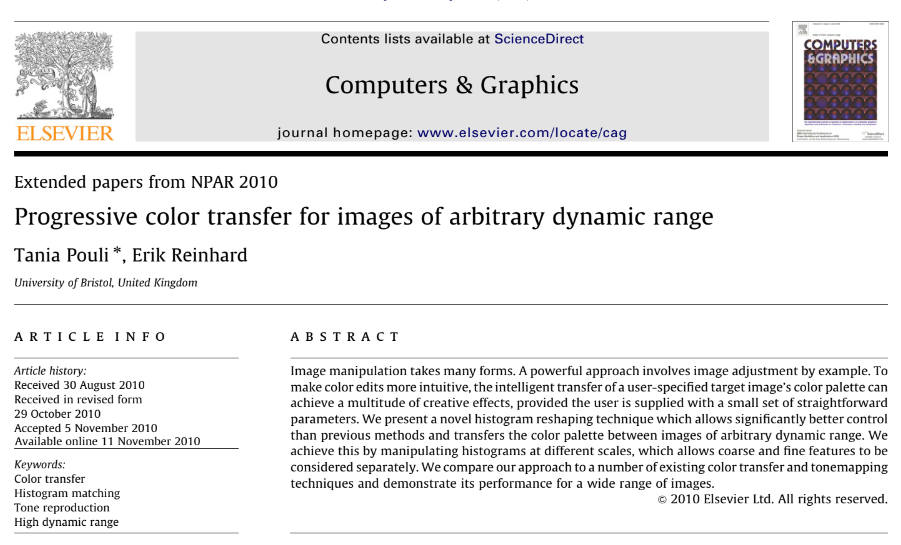
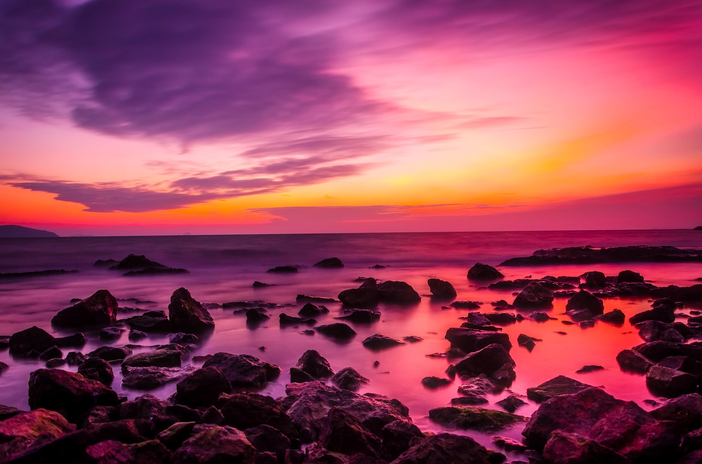

# Introduction to Digital Image Processing (Final Project)

## Final Project：
- Title：
    "Progressive color transfer for images of arbitrary dynamic range"
- Ref：
    

## Color Transfer Example：
- Source： 
- Target： 
- Results：
    - 100% Transfer： 
    - 75% Transfer： 
    - 50% Transfer： 
